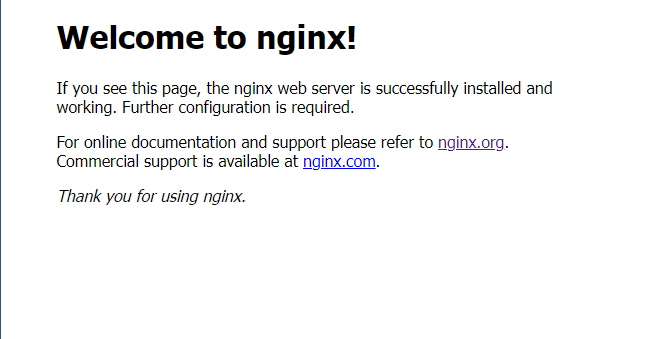
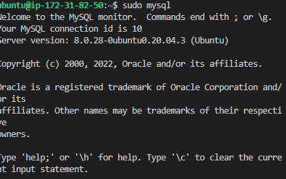
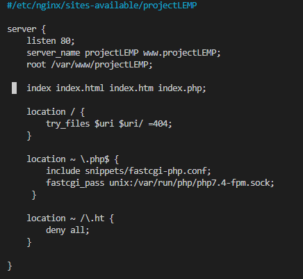
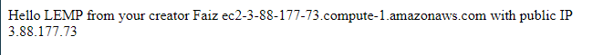
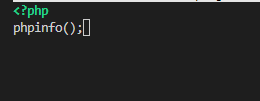
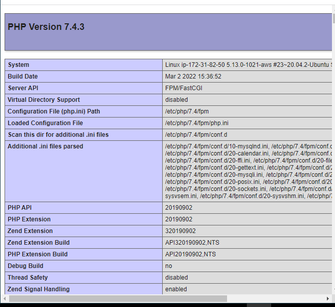
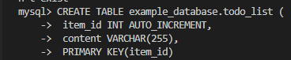

# **WEB STACK IMPLEMENTATION (LEMP STACK)**
## **INSTALLING THE NGINX SERVER**
### Update and upgrade apt with `sudo apt update && sudo apt upgrade`
### Install nginx using `sudo apt install nginx`
### Nginx install verification `sudo systemctl status nginx`

### allow access to our server locally by enabling it on port 80
`curl http://localhost:80`

## **INSTALLING MYSQL**
### install mysql using `sudo apt install mysql-server`
### secure mysql by running `sudo mysql_secure_installation`
### login to mysql using `sudo mysql`

## **INSTALLING PHP**
### While Apache embeds the PHP interpreter in each request, Nginx requires an external program to handle PHP processing and act as a bridge between the PHP interpreter itself and the web server. This allows for a better overall performance in most PHP-based websites, but it requires additional configuration. You’ll need to install php-fpm, which stands for “PHP fastCGI process manager”, and tell Nginx to pass PHP requests to this software for processing. Additionally, you’ll need php-mysql, a PHP module that allows PHP to communicate with MySQL-based databases
### To install these 2 packages at once run ` sudo apt insta;; php-fpm php-mysql`
## ** CONFIGURING NGINX TO USE PHP PROCESSOR**
### remember that nginx has one server block enabled by default and is configured to serve documents out of a directory at /var/www/html. but this only works for single sites to hosts multiple sites we'll crate a directory structure within /var/www for the  domain website we are creating
### create root web directory for the domain with
`sudo mkdir /var/www/projectLEMP`
### Next, assign ownership of the directory with the $USER environment variable using sudo chown, which will reference your current system user:
`sudo chown -R $USER:$USER /var/www/projectLEMP`
### Open a configuration file in Nginx's sites-available directory using nano
`sudo nano /etc/nginx/sites-available/projectLEMP`
### enter the code in the image below

### Activate your configuration by linking to the config file from Nginx’s sites-enabled directory using
`sudo ln -s /etc/nginx/sites-available/projectLEMP /etc/nginx/sites-enabled/`
### test the configuration for syntax error using
`sudo nginx -t`
### also wee need to disable the default configuration that we have allowed on port 80
`sudo unlink /etc/nginx/sites-enabled/default`
### then finally we reload nginx enable changes
`sudo systemctl reload nginx`
### The website is now active but the web root of our domain is empty therefore we create an index.hyml file in that location so that we can test that our new server block works as expected. Enter the following echo code
`sudo echo 'Hello LEMP from hostname' $(curl -s http://169.254.169.254/latest/meta-data/public-hostname) 'with public IP' $(curl -s http://169.254.169.254/latest/meta-data/public-ipv4) > /var/www/projectLEMP/index.html`
### now we can access the website on the browser using the IP Address on http://IP adress:80

## **TESTING PHP WITH NGINX**
### At this point your LEMP stack is completely installed and fully operational. You can test it by creating a test PHP file in your document root to ensure nginx can correctly hand .php files off to your php processor
### open a new file called info.php within your document root in your text editor:
`sudo nano /var/www/projectLEMP/info.php`
### inside type in the following 

### now open your server domain with 
### http://sever_domain_prIP/info.php
### you should see this image below in your server

### After confirming your LEMP stack can handle .php files you have to remove the file you created because it contains sensitive information about your php environment and your ubunbtu server this is done by using `sudo rm /var/www/projectLEMP/info.php`
### *note: you can always regenerate the server*
## **RETRIEVING DATA FROM MYSQL DATABASE WITH PHP (CONTINUED)**
# In this step we will create a test database(DB) with simple "To do list" and configure access to it, so the nginx website would be able to query data form the DB and display it. To do this we will need to create a new user with the mysql_native_password authentication method in order to be able to connect to the MySQL database from PHP.
### First, lets connect to the MySQL console using the root account
`sudo mysql`
### then from mysql console we create a new database by running the following command `CREATE DATABASE ``example_database``;`
### now you can create a new user and grant him full privileges in the database you have just created. Enter the following code in mysql console
`CREATE USER 'example_user'@'%' IDENTIFIED WITH mysql_native_password BY '*mysql secure password created*';`
### Finally we need to give this user permission over the *example_database* database by typing the following in the mysql console
`GRANT ALL ON example_database.* TO 'example_user'@'%';`
### now you can test if the new user has proper permissions by logging in to the MySQL console ahain, this time using the created custom user credentials:
mysql -u example_user -p
### this will ask you for the password and grant you access into mysql console
### open mysql database by typing this in to your console
`SHOW DATABASES;`
### now we will create a todo_list from the mysql console run the following statement

### to confirm that the data was succesfully saved to your table, run:on your mysql console
` SELECT * FROM example_database.todo_list;`
### you should get this output

### after confirming the output exit mysql console and create a PHP scipt that will connect to MySQL and query using nano
`nano /var/www/projectLEMP/todo_list.php`
### copy the code in the image below into the editor

### Open this page on your web browser by using the IP address followed by /todo_list.php

